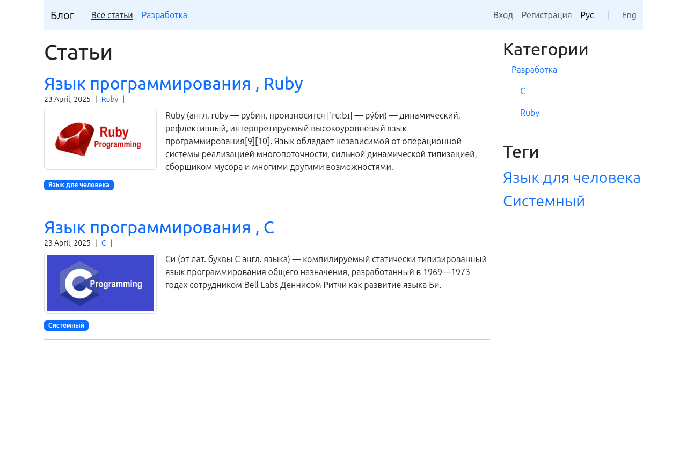

# Блог



## 📚 О проекте

Полнофункциональный блог , написанный на Ruby On Rails который позволяет : создавать , редактировать и удалять посты. В проекте реализована возможность прикрепления изображений к постам с помощью гемов CarrierWave и MiniMagick. Также посты можно группировать по категориям и подкатегориям , которые поддерживают древовидную структуру благодаря гему Ancestry. Для комментариев подключён внешний сервис Disqus. Посты удобно разбиты на страницы с помощью гема will_paginate. Реализована система тегов с визуальной иерархией , а именно : чем чаще используется тег , тем крупнее он отображается. Стилизация сделана с помощью Bootstrap , а для плавных и красивых анимаций используется библиотека AOS. Вдобавок в навигации реализованы небольшие хлебные крошки ( breadcrumbs ) , обеспечивающие лёгкое перемещение. Также в приложении реализована регистрация и авторизация пользователей через гем Devise с разграничением прав доступа на обычных пользователей и администраторов. Для удобства разработки также подключён гем letter_opener который позволяет открывать письма ( например , для подтверждения регистрации ) прямо в браузере без реальной отправки. Дополнительно реализована лёгкая интернализация ( i18n ) с поддержкой как русского так и английского языков , интерфейс сайта адаптирован под выбранный язык обеспечивая удобное и лёгкое переключение между ними.

🚀 Запустите сервер , командой :

```
rails s
```

☝🏻 Перед запуском сервера , если вы только что скачали проект , возможно вам потребуется установить недостающие гемы. Сделать это вы можете , при помощи команды :

```
bundle install
```

" Что делать , если что - то пошло не так ? "<br>
⚠️ Внимание! Если при запуске сервера вы получите ошибку вида :

```
ActiveRecord::PendingMigrationError

Migrations are pending. To resolve this issue, run:
bin/rails db:migrate
```

Это означает , что в проекте есть миграции которые ещё не применены. Просто выполните команду :

```
rails db:migrate
```

✅ После этого запустите сервер ещё раз , и у вас всё должно заработать :

```
rails s
```

🧙‍♂️ Так же , что немаловажно у вас может возникнуть ошибка при загрузке изображений. А именно :

Если при попытке загрузить изображение к посту вы вдруг получите странную ошибку с упоминанием ImageMagick , MiniMagick , convert или чего - то похожего — не пугайтесь! Скорее всего , у вас просто не установлена системная зависимость ImageMagick , которую используют гемы CarrierWave и MiniMagick для работы с изображениями ( например : сжатие , обрезка и пр.).

💡 Как установить ImageMagick ?

🪟 Windows :

Перейдите на официальный сайт ImageMagick и скачайте последнюю версию ImageMagick для Windows ( .exe установщик ).

🐧 Linux ( Ubuntu / Debian ) :

Откройте терминал и выполните :

```
sudo apt install imagemagick
```

🍎 macOS ( через Homebrew ) :

Откройте терминал и выполните :

```
brew install imagemagick
```

После установки ImageMagick не забудьте перезапустить сервер , чтобы изменения вступили в силу. После этого вы сможете без проблем прикреплять изображения к постам.

Теперь загрузка изображений должна работать корректно.

👑 Как назначить администратора ?

По умолчанию при регистрации все пользователи создаются с ролью обычного пользователя ( admin = false ). Чтобы вручную назначить администратора :

1) Зарегистрируйтесь на сайте.
2) Откройте консоль Rails :

```
rails c
```

3) Найдите пользователя ( например , с id = 1 ) :

```
u = User.find(1)
u.admin = true
u.save
```

Теперь этот пользователь будет иметь административный доступ.

Проект был создан , без использования тестов. Я просто написал проект с нуля не прогоняя его через тесты , так как еще не освоил их написание. Этот проект был в первую очередь практикой работы с Рельсами.

В целом , этот проектик — это полноценный блог с красивым , лёгким и что самое главное простым интерфейсом в котором приятно работать как пользователю так и администратору.

Пусть каждая строка кода приносит радость и вдохновение , а любые преодолённые трудности и ошибки на пути превращаются в новые знания и возможности 💫.